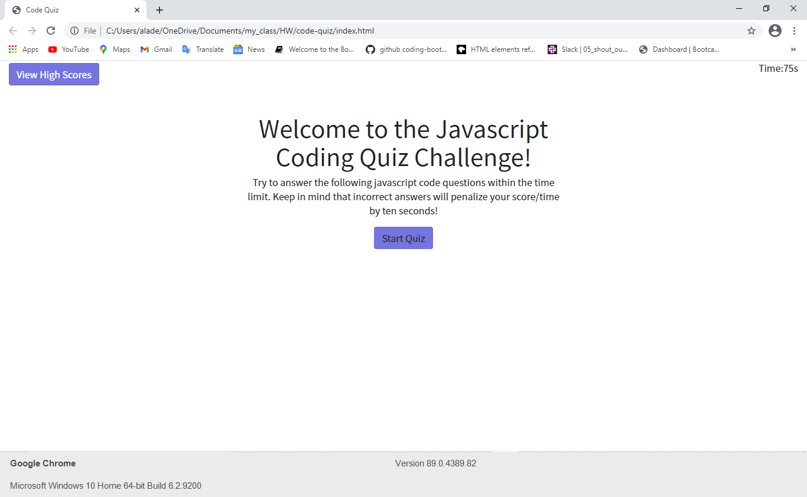
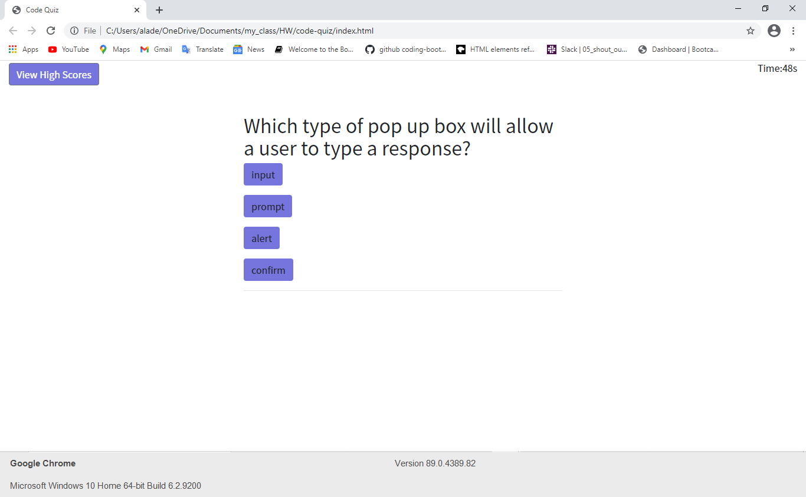
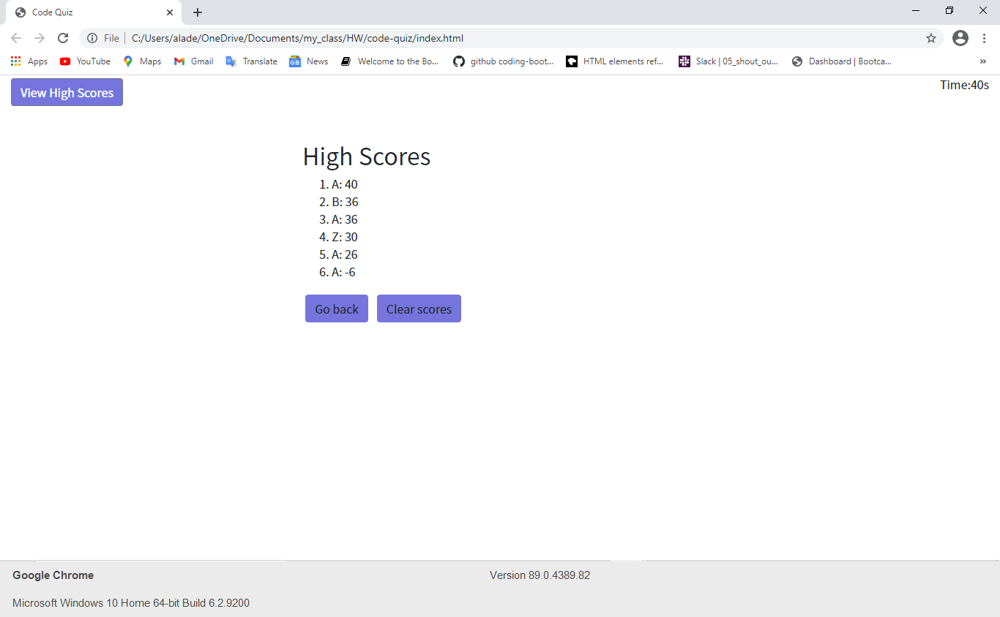

# code-quiz

## Title:
Code quiz

## Table of Contents
  * [Description](#description)
  * [Questions](#questions)
  * [License](#license)

## Description

The deployed site:

The following GIF demonstrates the application functionality:

## Table of Contents
  * [Installation](#installation)
  * [Questions](#questions)
  * [License](#license)

## Questions
The following is my Github accounts:

-[decoste](https://github.com/decoste)

Please feel free to send us an email if you have any question(s):

aladecoste@gmail.com

## License
MIT license

Screenshots of the website:

